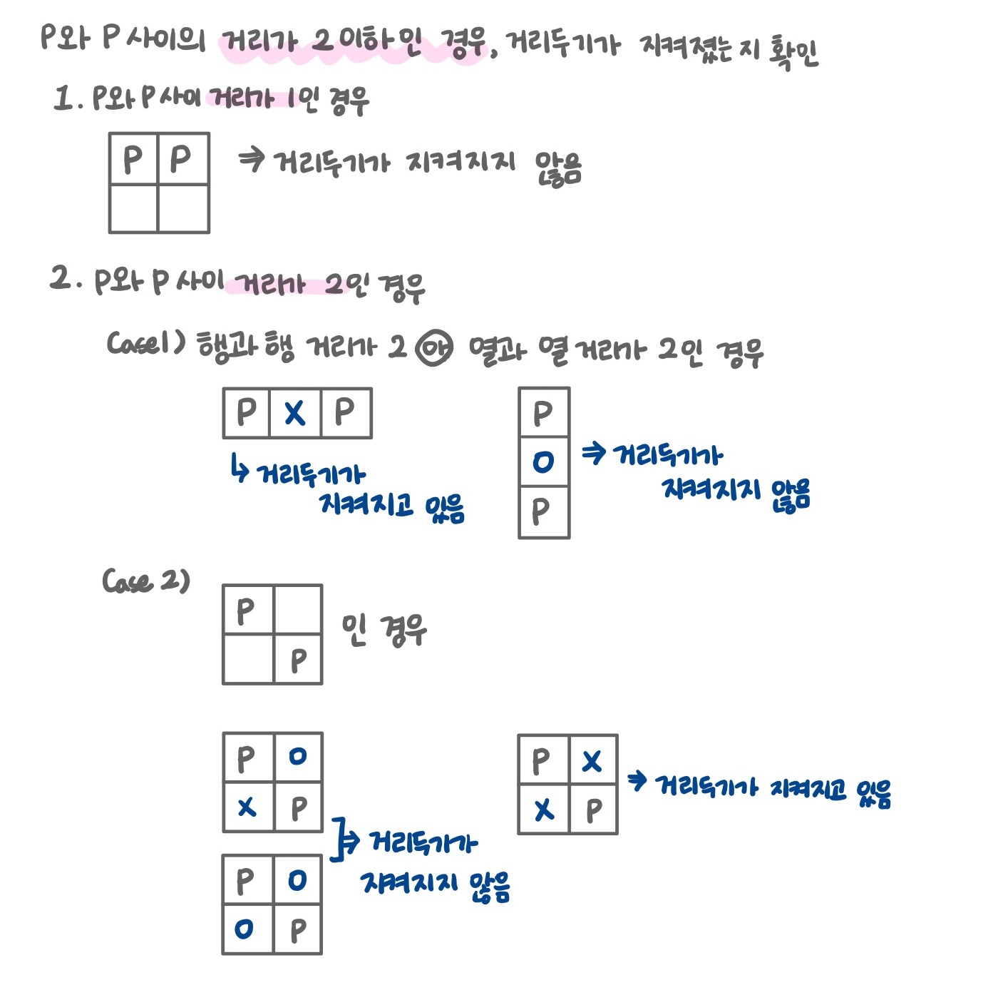

## 거리두기 확인하기 (2021 카카오 채용연계형 인턴십)

<a href='https://programmers.co.kr/learn/courses/30/lessons/81302'>Click! 거리두기 확인하기 풀어보기 Click!</a>

### 문제 풀이 설명

- ## 풀이
  - **places** 배열을 `map`함수를 써서 각각의 결과 값 배열을 구한다.
  - **places** 배열의 각각을 **place**라 두고 배열 내부의 행열을 탐색한다.
  - **P**값이 나올 경우 거리두기가 시행되었는지 체크한다.
    
  - 거리두기가 지켜졌다는 결과 1이 나올 경우 **part**배열에 P의 자리 값을 저장하고 다시 **place** 배열을 탐색한다.
